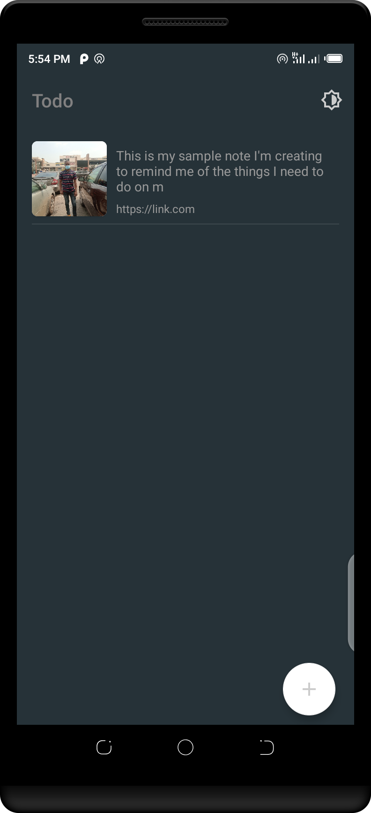

# Todoapp

Room Database (Create, Update, Read and Delete of task)

Mvvm Architecture (observe data from database)

Light and Dark Mode (theme)

Tools (Helper functions)

Task UnitTest(little test for entity class)

